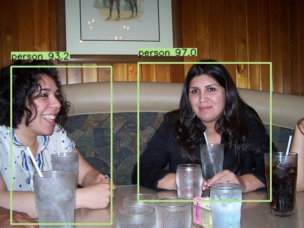

# Minimal YoloV3 Implementation By PyTorch

This repository provides a minimal implementation of YoloV3 using PyTorch for object detection tasks. The implementation supports training from scratch and performing predictions on new images.
<p align="center">
  <br/>
  <i>An example of my model's output.</i>
</p>

## Training

### 1. Download Datasets
Download the VOC 2007 and 2012 datasets and place them in the `dataset` folder as follows:
  ```
  VOCDevkit
  ├── VOC2007
  │   ├── Annotations  
  │   ├── ImageSets
  │   ├── JPEGImages
  │   └── ...
  └── VOC2012
      ├── Annotations  
      ├── ImageSets
      ├── JPEGImages
      └── ...
  ```
### 2. Prepare the Datasets
Run the preparation scripts:
```
cd dataset
python voc_script.py
cd ..
```
### 3. Download Pretrained weights
Download the pretrained Darknet 53 weights darknet53_448.weights and place it in the `pretrained` folder. Alternatively, place a .pth file in the folder if continuing training from a checkpoint.
### 4. Run Training Script
python train.py --pretrained_weights path_to_pretrained_weights

## Predict
### 1. Ensure pretrained weights are available
### 2. Run Prediction Script
python predict.py --image_path path_to_img --pretrained_weights path_to_pretrained_weights

## Result Of My Trained Model

| Metric    | Value  |
|-----------|--------|
| Precision | 0.5397 |
| Recall    | 0.7452 |
| mAP       | 0.6187 |

I trained for 100 epochs on Kaggle Gpu P100 for nearly 10 hours. Due to limited resources and time, the results are not optimal. This repository is primarily for practice and requires significant improvements.

## References

- https://arxiv.org/abs/1804.02767
- https://github.com/synml/yolov3-pytorch/tree/master 
